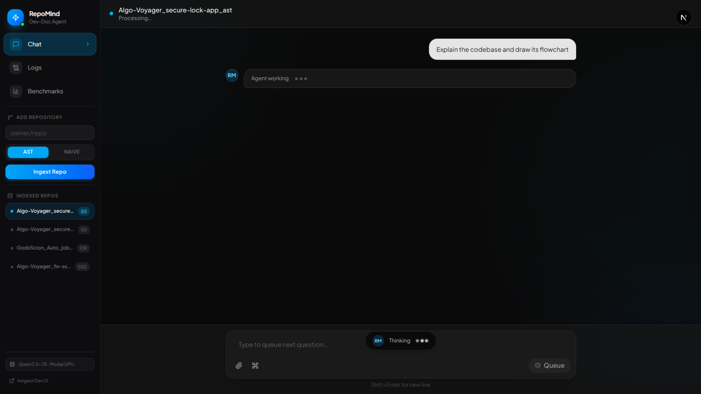
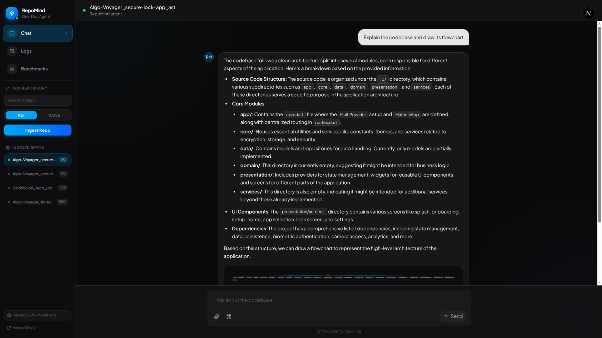
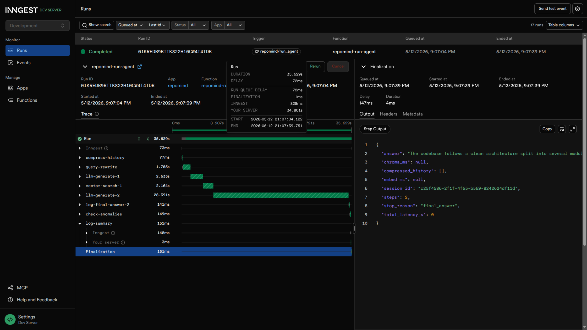

# repomind

A developer documentation agent — point it at a GitHub repo and ask questions about the code in plain English. Answers are grounded in the repo: the agent retrieves relevant chunks from a local vector index and cites file paths and line numbers.

> Full architecture, chunking deep-dive, and engineering decisions → [`docs/ARCHITECTURE.md`](docs/ARCHITECTURE.md)

---

## Stack

| Layer | Technology |
|-------|-----------|
| **LLM** | `Qwen/Qwen2.5-7B-Instruct` on Modal (custom `/generate` endpoint) |
| **Agent loop** | Text-based ReAct — parses `Action` / `Action Input` from model output |
| **Embeddings** | `BAAI/bge-small-en-v1.5` on Modal — OpenAI-compatible `/v1/embeddings` |
| **Vector DB** | ChromaDB (persistent, `./chroma_db`) |
| **Backend** | FastAPI + [Inngest](https://www.inngest.com) for durable background jobs |
| **Frontend** | Next.js 14 (App Router) |
| **GitHub API** | PyGithub |

No LangChain. No LlamaIndex.

---

## Setup

### 1. Python environment

```bash
python -m venv .venv
source .venv/bin/activate      # Windows: .venv\Scripts\activate
pip install -r requirements.txt
```

### 2. Deploy Modal services

Both the LLM and embeddings run on Modal (shared with rag-learning). Deploy once:

```bash
cd ../rag-learning
modal deploy qwen_modal.py
cd ../repomind
```

### 3. Environment variables

```bash
cp .env.example .env
```

| Variable | Description |
|----------|-------------|
| `VLLM_API_KEY` | Shared API key for both Modal services |
| `QWEN_GENERATE_URL` | LLM generate endpoint URL from Modal |
| `EMBED_BASE_URL` | Embedding endpoint URL from Modal — **must end with `/v1`** |
| `EMBED_MODEL` | `BAAI/bge-small-en-v1.5` |
| `GITHUB_TOKEN` | GitHub personal access token (repo read access) |

### 4. Run

Open three terminals:

```bash
# Terminal 1 — FastAPI + Inngest backend
uvicorn server:app --port 8000

# Terminal 2 — Inngest Dev Server  (UI at http://localhost:8288)
npx inngest-cli@latest dev -u http://localhost:8000/api/inngest

# Terminal 3 — Next.js frontend  (http://localhost:3000)
cd frontend && npm install && npm run dev
```

---

## Usage

**Ingest a repo** — enter `owner/repo` in the sidebar, choose AST or Naive mode, click "Ingest Repo". Progress is visible in the Inngest Dev UI at `localhost:8288`.

**Ask questions** — select an indexed repo from the sidebar and type your question in the chat.

The agent processes the query asynchronously — the UI shows a live "Agent working…" indicator while the ReAct loop runs tool calls in the background.



Once the loop completes, the answer streams in with file-path citations. Asking for a diagram or flowchart produces an interactive Mermaid chart you can click to zoom.



Every run is tracked as a durable job in Inngest — open `localhost:8288` to inspect each pipeline step and its timing.



**Run the benchmark** — after ingesting both `ast` and `naive` collections:

```bash
python eval/compare.py <owner>/<repo>
```

Results appear on the `/benchmarks` page.

### CLI (no server required)

```bash
python ingest.py <owner>/<repo> <ast|naive>
python agent.py <owner>_<repo>_<mode> "How does error handling work?"
python tools.py <owner>_<repo>_<mode>   # smoke-test retrieval
```

---

## Project layout

```
repomind/
├── server.py              # FastAPI + Inngest (ingest, run_agent, agent_completed)
├── inngest_setup.py       # Shared Inngest client
├── ingest.py              # Repo fetch → chunk → embed → ChromaDB
├── agent.py               # ReAct loop via httpx → QWEN_GENERATE_URL
├── tools.py               # vector_search, get_file, get_recent_commits
├── prompts.py             # ReAct, query-rewrite, history-compression prompts
├── logger.py              # Structured JSONL logging → agent_logs.jsonl
├── assest/                # Screenshots used in this README
├── frontend/              # Next.js 14 UI
│   ├── app/chat/          # Chat page
│   ├── app/logs/          # Logs page
│   ├── app/benchmarks/    # Benchmark results page
│   ├── components/        # Sidebar, MarkdownRenderer, AnimatedTextarea
│   └── lib/api.ts         # API client
├── eval/
│   ├── compare.py         # AST vs naive benchmark (Qwen as judge)
│   ├── test_queries.py    # Correctness test suite
│   └── metrics.py         # Latency / token / cost metrics
├── docs/
│   └── ARCHITECTURE.md    # System design, chunking, pipeline, challenges
├── requirements.txt
├── .env.example
└── .gitignore
```

---

## Secrets and generated files

`.env`, `chroma_db/`, `agent_logs.jsonl`, `eval_results.jsonl`, and `frontend/public/benchmark_results.json` are gitignored. Never commit them.
